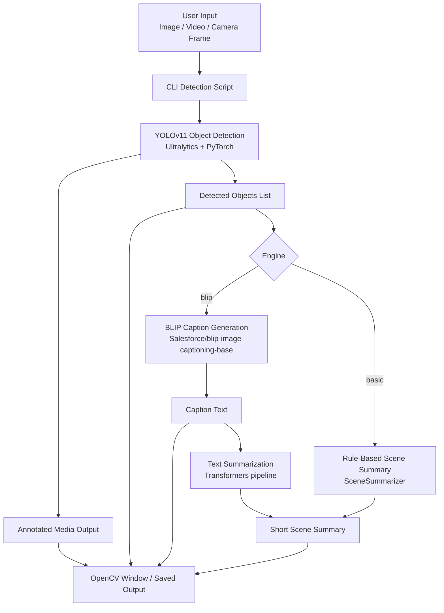

# Smart Scene Understanding Architecture

## Runtime Flow

1. User runs image/video/camera script and provides input media.
2. YOLOv11 detects objects and generates annotated output.
3. If engine is `blip`, BLIP produces a scene caption.
4. Caption is summarized into a short scene summary.
5. Output displays detected objects, caption, and summary in CLI/visual output.
